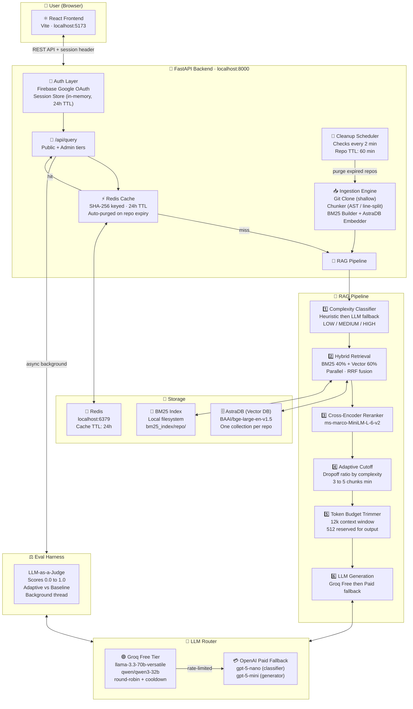

# 💬 Chat With Your Repo

> **Ask natural-language questions about any public GitHub repository — powered by Hybrid Search RAG with adaptive context, LLM-as-a-Judge evaluation, and smart cost routing.**

---

## ✨ What It Does

**Chat With Your Repo** lets you point to any public GitHub URL and immediately start asking questions about the code. It doesn't just do keyword search — it understands your intent through a multi-stage pipeline:

1. **Classifies** how complex your question is (LOW / MEDIUM / HIGH)
2. **Retrieves** the most relevant code chunks using both BM25 (keyword) and vector (semantic) search in parallel
3. **Fuses** both results using Reciprocal Rank Fusion (RRF)
4. **Reranks** candidates with a cross-encoder for precision
5. **Trims** context adaptively so expensive tokens are never wasted
6. **Generates** a concise, grounded answer from an LLM
7. **Evaluates** answer quality automatically using LLM-as-a-Judge scoring

---

## 🏗️ Architecture Overview



---

## 📁 Project Structure

```
Repo-context-copilot/
│
├── backend/                      # FastAPI Python backend
│   ├── main.py                   # API server, all route definitions
│   ├── pipeline.py               # Core RAG pipeline logic
│   ├── ingestion.py              # Repo clone → chunk → embed → index
│   ├── llm_router.py             # Smart LLM cost routing (free → paid)
│   ├── eval_harness.py           # LLM-as-a-Judge evaluation
│   ├── cache.py                  # Redis cache wrapper
│   ├── cleanup.py                # TTL-based repo expiry scheduler
│   ├── state.py                  # Global in-memory application state
│   ├── config.py                 # Centralised settings (from .env)
│   ├── logging_utils.py          # Structured logging + query log store
│   │
│   ├── auth_pkg/
│   │   └── firebase_auth.py      # Firebase ID token verification + sessions
│   │
│   └── db/
│       ├── vector_store.py       # AstraDB vector store wrapper
│       ├── bm25_retriever.py     # BM25 index build/query
│       ├── hybrid_search.py      # RRF fusion of BM25 + vector results
│       ├── reranker.py           # Cross-encoder reranker
│       └── chunking.py           # AST-aware code chunker
│
├── frontend-react/               # React + Vite frontend
│   └── src/
│       ├── App.jsx               # Root app, routing, auth handling
│       ├── api.js                # Axios API client
│       └── components/
│           ├── Navbar.jsx        # Top bar: brand, repo selector, auth
│           ├── ChatView.jsx      # Main Q&A chat interface
│           ├── IngestPanel.jsx   # Repo URL input + ingestion progress
│           ├── AdminDashboard.jsx# Query logs, cache stats, system health
│           └── QueryLogCard.jsx  # Per-query log card with score bars
│
├── bm25_index/                   # Persisted BM25 indexes (one dir per repo)
├── temp/repos/                   # Shallow-cloned repos (auto-purged after TTL)
├── .env                          # Environment variables (see setup below)
├── run.sh                        # One-command startup script
└── requirements.txt              # Python dependencies
```

---

## 🔄 How a Query Flows — Step by Step

### Phase 1 — Ingestion (one-time per repo)

```
GitHub URL
    │
    ▼
[Git Clone — shallow depth=1]  →  temp/repos/<repo>/
    │
    ▼
[Chunker — db/chunking.py]
  ├── Python: AST-based (class / function / method boundaries)
  ├── JS/TS/Go/Java/Rust/C/C++: Regex function/class boundaries
  ├── Markdown/RST/TXT: Section-level splits
  └── Max chunk: 3000 chars, with metadata (file_path, symbol_name, lines)
    │
    ▼
[Embedding]  BAAI/bge-large-en-v1.5  →  AstraDB collection (one per repo)
    │
    ▼
[BM25 Index]  Saved to  bm25_index/<repo>/
    │
    ▼
[IngestedRepo registered in state.repos]
  └── expires_at = now + REPO_TTL_MINUTES (default 60 min)
```

### Phase 2 — Query

```
User question: "How does authentication work?"
    │
    ▼
[1. Complexity Classification — pipeline.py]
  ├── Heuristic first (instant, zero LLM cost):
  │     LOW  → short questions ("what is X", "where is Y", "which file")
  │     HIGH → contains "trace", "architecture", "end-to-end", long queries
  │     None → falls through to LLM
  └── LLM classifier_router  →  JSON { complexity, confidence, reason }
    │
    ▼
[2. Hybrid Retrieval — db/hybrid_search.py]
  ├── BM25 query  ──┐
  │   (40% weight) │  ← run in parallel (ThreadPoolExecutor, 15s timeout)
  ├── Vector query ─┘
  │   (60% weight, AstraDB cosine similarity)
  └── RRF Fusion:
        fused_score = bm25_rrf + vector_rrf
        rrf_k = 60,  score = weight × (1 / (k + rank))
    │
    ▼
[3. Relevance Filter]
  └── Drop chunks where fused_score / max_rrf_score < 0.2 (min_score)
    │
    ▼
[4. Cross-Encoder Reranking — db/reranker.py]
  └── cross-encoder/ms-marco-MiniLM-L-6-v2
      Scores each (query, chunk) pair for fine-grained relevance
    │
    ▼
[5. Adaptive Cutoff — pipeline.py]
  ├── Minimum chunks by complexity:  LOW=3,  MEDIUM=4,  HIGH=5
  ├── Scans sorted rerank scores for a "score dropoff"
  │     Dropoff threshold:  LOW=8%,  MEDIUM=10%,  HIGH=12%
  └── Stops including chunks after the first significant quality cliff
    │
    ▼
[6. Token Budget Trimmer — pipeline.py]
  ├── Context window: 12,000 tokens  (MODEL_CONTEXT_WINDOW)
  ├── Reserved for output: 512 tokens
  ├── Overhead (prompt + query): ~150 tokens
  └── Greedily includes chunks until budget is exhausted
    │
    ▼
[7. LLM Generation — llm_router.py]
  ├── Tries Groq free models in configured order
  ├── On rate-limit (429) → model put in 6-hour cooldown, tries next
  └── All free models exhausted → falls back to OpenAI paid (gpt-5-mini)
    │
    ▼
Answer returned to user
```

### Phase 3 — Evaluation (background, async)

```
For every query (when LOG_COMPARISON_MODE=true and not a cache hit):
    │
    ├── Run baseline pipeline (same query, adaptive cutoff DISABLED, all chunks)
    ├── Record both adaptive and baseline answers in query log
    │
    └── [Background thread — eval_harness.py]
          ├── Judge adaptive answer   →  score 0.0–1.0
          ├── Judge baseline answer   →  score 0.0–1.0
          └── Accuracy retained = round(100 × adaptive_score / baseline_score)
```

---

## ⚡ Redis Caching

Every successful query result is cached in Redis, keyed by a SHA-256 hash of `repo_name + commit_sha + normalized_query`.

| Scenario | Cache Behaviour |
|---|---|
| Same question, same repo + commit | Returns cached result instantly (no LLM call) |
| Repo re-ingested (new commit SHA) | Old cache keys are unreachable — new SHA differs |
| Repo TTL expires (60 min) | All Redis keys for that repo are hard-deleted |
| Admin clears cache via dashboard | Scans and deletes all `ragcache:*` keys |
| Key natural expiry | 24 hours (if repo TTL has not triggered first) |

---

## 🤖 LLM Router & Cost Management

The backend runs **three independent router instances**, each drawing from the same Groq free-tier pool:

| Router | Purpose | Max Tokens |
|---|---|---|
| `classifier_router` | Query complexity classification | 128 |
| `generation_router` | Answer generation | 1024 |
| `judge_router` | LLM-as-a-Judge scoring | 512 |

**Routing strategy:**
1. Try each Groq free model in order (`GROQ_FREE_MODELS` list in `.env`)
2. Rate-limit error (429) → that model enters a **6-hour cooldown**
3. All free models in cooldown → **paid OpenAI fallback** (gpt-5-nano / gpt-5-mini)
4. Every `ModelResult` carries `model_name`, `provider`, and `paid` flag so the admin UI shows exactly which model answered

---

## ⚖️ LLM-as-a-Judge Evaluation

After every non-cached query, a background thread scores both the **adaptive** and **baseline** answers against the retrieved context.

**Score scale:**

| Score | Meaning |
|---|---|
| `1.0` | Fully correct and directly answers the question |
| `0.75` | Mostly correct, minor details missing |
| `0.50` | Partially correct or key details missing |
| `0.25` | Mostly incorrect or vague |
| `0.0` | Completely wrong or hallucinated |

**Fast-path abstention detection:** If the answer contains phrases like *"cannot be determined from the provided context"* or *"no information"*, it is automatically scored `1.0` (correct abstention) — no judge LLM call is made.

The **Accuracy Retained** figure in the admin dashboard:
```
accuracy_retained = min(100, round(100 × adaptive_score / baseline_score))
```
This tells you how much answer quality the token-efficient adaptive pipeline preserved vs the brute-force baseline.

**Score bar colours in `QueryLogCard`:**
- 🟢 Green — score ≥ 75%
- 🟡 Amber — score ≥ 50%
- 🔴 Red   — score < 50%

---

## 🔐 Authentication & Access Control

| User Type | Access |
|---|---|
| **Public (unauthenticated)** | Ingest repos, ask questions — receives `answer` only |
| **Admin** | Full response: `answer`, `sources`, `confidence`, `complexity`, `model info`, `retrieval_chunks` |
| **Admin dashboard** | Query logs, LLM-as-a-Judge scores, cache stats, health, log clearing, repo deletion |

**Auth flow:**
1. User clicks "Sign in with Google" → FastAPI opens `/auth/login` popup
2. Firebase JS SDK triggers Google OAuth — picker opens immediately (no second click)
3. On success, Firebase ID token posted to `/auth/verify`
4. Backend verifies token with Google's public keys — **no service account required**
5. Email checked against `ADMIN_EMAIL` in `.env` → session created with 24h expiry
6. `session_id` returned to frontend via URL param, then sent as `X-Session-Id` header on all privileged requests

---

## 🧹 Repo TTL & Cleanup

To protect free-tier database limits every ingested repo has a **1-hour TTL** (configurable via `REPO_TTL_MINUTES`):

- `APScheduler` daemon runs every **2 minutes**, checking `now >= repo.expires_at`
- On expiry the repo is fully purged:
  - AstraDB collection dropped
  - BM25 index deleted from local disk
  - Cloned files in `temp/repos/` deleted
  - All Redis cache keys hard-deleted (`purge_repo`)
- The frontend repo dropdown refreshes from `/api/repos` and removes expired repos automatically

---

## 🚀 Quick Start

### Prerequisites

- Python 3.10+
- Node.js 18+
- Redis running locally (`redis-server` or via Docker)
- [DataStax AstraDB](https://astra.datastax.com/) account (free tier is fine)
- [Firebase project](https://console.firebase.google.com/) with **Google sign-in** enabled
- [Groq API key](https://console.groq.com/) (free tier)

### 1. Clone & Install

```bash
git clone https://github.com/shreeragkh/Repo-context-copilot.git
cd Repo-context-copilot

# Python backend
python -m venv .venv
source .venv/bin/activate
pip install -r requirements.txt

# React frontend
cd frontend-react
npm install
cd ..
```

### 2. Configure `.env`

```env
# ── LLM ────────────────────────────────────────────────────────────────────
GROQ_API_KEY=your_groq_api_key
OPENAI_API_KEY=your_openai_key      # Optional — used only when Groq is exhausted
GROQ_FREE_MODELS=llama-3.3-70b-versatile,qwen/qwen3-32b
CLASSIFIER_PAID_MODEL=gpt-5-nano
GENERATION_PAID_MODEL=gpt-5-mini

# ── AstraDB (vector store) ──────────────────────────────────────────────────
API_ENDPOINT=https://your-db-id-region.apps.astra.datastax.com
API_TOKEN=AstraCS:...

# ── Redis ───────────────────────────────────────────────────────────────────
REDIS_HOST=localhost
REDIS_PORT=6379
REDIS_PASSWORD=                     # Leave blank for local Redis

# ── Firebase (Google Auth) ──────────────────────────────────────────────────
FIREBASE_API_KEY=...
FIREBASE_AUTH_DOMAIN=your-project.firebaseapp.com
FIREBASE_PROJECT_ID=your-project-id
FIREBASE_STORAGE_BUCKET=your-project.appspot.com
FIREBASE_MESSAGING_SENDER_ID=...
FIREBASE_APP_ID=...
ADMIN_EMAIL=your.email@gmail.com

# ── Behaviour ───────────────────────────────────────────────────────────────
REPO_TTL_MINUTES=60
LOG_COMPARISON_MODE=true
FRONTEND_URL=http://localhost:5173
CORS_ORIGINS=http://localhost:5173

# ── Models (downloaded from HuggingFace on first run) ──────────────────────
EMBEDDING_MODEL=BAAI/bge-large-en-v1.5
RERANKER_MODEL=cross-encoder/ms-marco-MiniLM-L-6-v2
```

### 3. Run

**Option A — single script:**
```bash
chmod +x run.sh
./run.sh
```

**Option B — two terminals:**
```bash
# Terminal 1: Backend
cd backend
uvicorn main:app --host 0.0.0.0 --port 8000 --reload

# Terminal 2: Frontend
cd frontend-react
npm run dev
```

Open **http://localhost:5173** in your browser.

---

## 📡 API Reference

All endpoints are served at `http://localhost:8000`.

| Method | Endpoint | Auth | Description |
|---|---|---|---|
| `GET` | `/auth/login` | Public | Google OAuth popup page |
| `POST` | `/auth/verify` | Public | Exchange Firebase ID token for a session |
| `GET` | `/auth/me` | Session | Get current user profile |
| `POST` | `/auth/logout` | Session | Destroy session |
| `GET` | `/api/repos` | Public | List currently ingested repos |
| `POST` | `/api/ingest` | Public | Start ingesting a GitHub repo (async background task) |
| `GET` | `/api/ingest/status` | Public | Check ingestion progress and errors |
| `DELETE` | `/api/ingest/{repo}` | Admin | Manually purge an ingested repo |
| `POST` | `/api/query` | Public / Admin | Ask a question about a repo |
| `GET` | `/api/health` | Admin | Redis, reranker, and per-repo health |
| `GET` | `/api/logs` | Admin | Recent structured backend logs |
| `POST` | `/api/logs/clear` | Admin | Clear in-memory log buffer |
| `GET` | `/api/query-logs` | Admin | Per-query log: answers, scores, model used |
| `POST` | `/api/query-logs/clear` | Admin | Clear query log history |
| `POST` | `/api/cache/clear` | Admin | Flush all Redis cache entries |

Interactive Swagger docs: **http://localhost:8000/docs**

---

## 🛠️ Tech Stack

| Layer | Technology |
|---|---|
| **Frontend** | React 18, Vite, Lucide icons |
| **Backend** | FastAPI, Python 3.10+, Uvicorn |
| **Embeddings** | `BAAI/bge-large-en-v1.5` — HuggingFace, 1024-dim |
| **Vector DB** | DataStax AstraDB (cosine similarity) |
| **BM25** | `bm25s` — local filesystem index |
| **Reranker** | `cross-encoder/ms-marco-MiniLM-L-6-v2` |
| **LLMs** | Groq (free tier) + OpenAI (paid fallback) |
| **Cache** | Redis — `SETEX` with 24h TTL |
| **Auth** | Firebase Google OAuth — no service account needed |
| **Scheduler** | APScheduler — daemon thread, 2-min check interval |
| **Token counting** | `tiktoken` — cl100k_base encoding |

---

## 📜 License

MIT — see [LICENSE](./LICENSE) for details.
